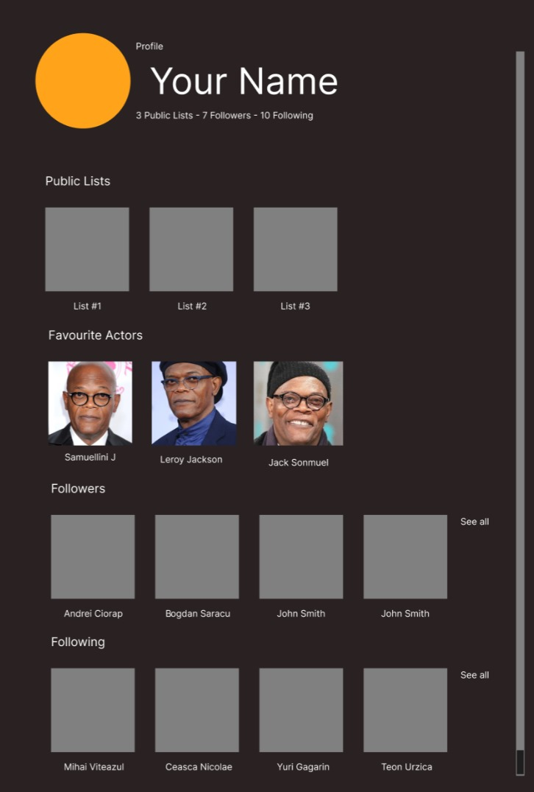
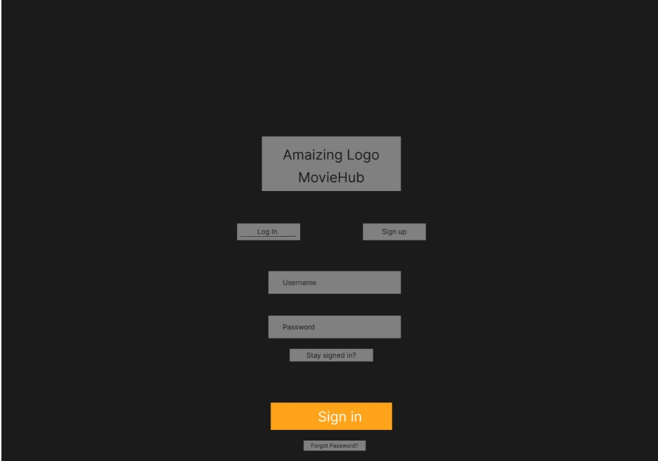

<div align = "center">
<pre>
███╗   ███╗ ██████╗ ██╗   ██╗██╗███████╗██╗  ██╗██╗   ██╗██████╗ 
████╗ ████║██╔═══██╗██║   ██║██║██╔════╝██║  ██║██║   ██║██╔══██╗
██╔████╔██║██║   ██║██║   ██║██║█████╗  ███████║██║   ██║██████╔╝
██║╚██╔╝██║██║   ██║╚██╗ ██╔╝██║██╔══╝  ██╔══██║██║   ██║██╔══██╗
██║ ╚═╝ ██║╚██████╔╝ ╚████╔╝ ██║███████╗██║  ██║╚██████╔╝██████╔╝
╚═╝     ╚═╝ ╚═════╝   ╚═══╝  ╚═╝╚══════╝╚═╝  ╚═╝ ╚═════╝ ╚═════╝ 
---------------------------------------------------------------
Web & Database Technologies (CSE1500) Project
A simple html website for movie lovers
</pre>
</div>

## 0. Preview


## 1. Usage example
This project has a little bit of JS, so you can't just open the HTML file in your browser. You need to run a server. Here are two ways to do it:
### 1.1. Running a server with Python
A simple way to run a server is to use Python. You can use the following command to run a server in the project directory:
```bash
python3 -m http.server
```
Then you can open the website in your browser by going to
```
http://localhost:8000
```
### 1.2. Running a server with VSCode
Another way is to use the "Live Server" extension from VS Code to run the server. Just right click on the `index.html` file and select "Open with Live Server".

## 2. Wireframes

### Home Page


### Profile Page


### Login Page



## 3. TODOs
- make font roboto
- make home page better
- settings
- premium
- list page
- footer

### Teon
- search page

### Gali
- whole loging button clickable
- profile page
- list page

## 4. Done
### Teon
- header bar - proper way
- Logo on home page
- More orange on home page

### Gali
- woke up
